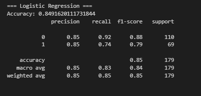
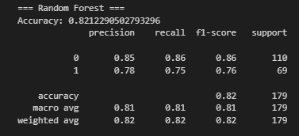

# Titanic Survival Prediction (acc ~0.85) 🛳️

This notebook explores the Titanic dataset, performs data cleaning, feature engineering, and applies machine learning models (Logistic Regression and Random Forest) to predict passenger survival. 
---

## Step 1: Dataset Overview

The dataset comes from the famous Kaggle Titanic competition.  
It contains information about passengers on the Titanic, such as demographics, ticket class, and survival status.

### Key Columns
| Column       | Description |
|--------------|-------------|
| PassengerId  | Unique passenger identifier |
| Survived     | Survival (0 = No, 1 = Yes) |
| Pclass       | Ticket class (1 = 1st, 2 = 2nd, 3 = 3rd) |
| Name         | Passenger name (contains titles such as Mr, Mrs, Miss) |
| Sex          | Gender |
| Age          | Age in years |
| SibSp        | Number of siblings/spouses aboard |
| Parch        | Number of parents/children aboard |
| Ticket       | Ticket number |
| Fare         | Passenger fare |
| Cabin        | Cabin number (many missing values) |
| Embarked     | Port of Embarkation (C = Cherbourg, Q = Queenstown, S = Southampton) |

   

---

##  Step 2: Exploratory Data Analysis (EDA)  

We explored the dataset to better understand the relationships between features and survival outcomes.  
Key steps:  
- Inspected dataset structure and checked for missing values.  
- Analyzed feature distributions (e.g., Age, Fare).  
- Studied correlations between numerical features and survival.  
- Visualized survival rates across different passenger groups.  

 Example: Survival rates by Age Group  
 

 Example: Correlation Heatmap  
  

---

## 🔧 Step 3: Handle Missing Values  

To ensure the dataset is complete and ready for modeling, we handled missing data:  
- **Age**: Imputed using a **Random Forest Regressor**.  
- **Embarked**: Filled missing values with the most frequent value (`S`).  
- **Cabin**: Dropped due to excessive missing values.  

  Example: Age distribution before and after imputation  
  

---

##  Step 4: Feature Engineering  

We created new features and transformed existing ones to improve model performance:  
- **Title**: Extracted from the passenger’s name (e.g., Mr, Mrs, Miss, etc.).  
- **FamilySize**: Combined `SibSp + Parch + 1`.  
- **IsAlone**: Binary variable indicating if passenger traveled alone.  

 Example: Distribution of new feature *FamilySize*  
  

---
---

##  Step 5: Encode & Normalize Data
Convert categorical variables into numeric format and scale continuous features:
- **Encoding**:
  - `Sex` → binary (0 = female, 1 = male)
  - `Embarked` → one-hot (`Embarked_C`, `Embarked_Q`, `Embarked_S`)
- **Normalization**:
  - Standardized `Age` and `Fare` (mean = 0, std = 1)

---

##  Step 6: Split Data
Separate features (X) and target (y), then split into **training** and **validation** sets for fair model evaluation.

---

##  Step 7: Run Logistic Regression
Train a baseline **Logistic Regression** model and evaluate it on the validation split:  
- Metrics: Accuracy, Precision, Recall, F1  
- Purpose: simple, interpretable baseline for comparison

###  Logistic Regression Results
Performance of the Logistic Regression model on the validation set:

---

##  Step 8: Run Random Forest
Train a **Random Forest Classifier** and evaluate it on the same validation split:  
- Metrics: Accuracy, Precision, Recall, F1  
- Purpose: stronger non-linear ensemble model for performance comparison

  ###  Random Forest Results
Performance of the Random Forest Classifier on the validation set:

  

