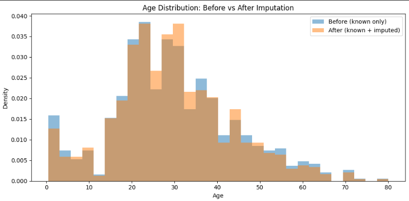
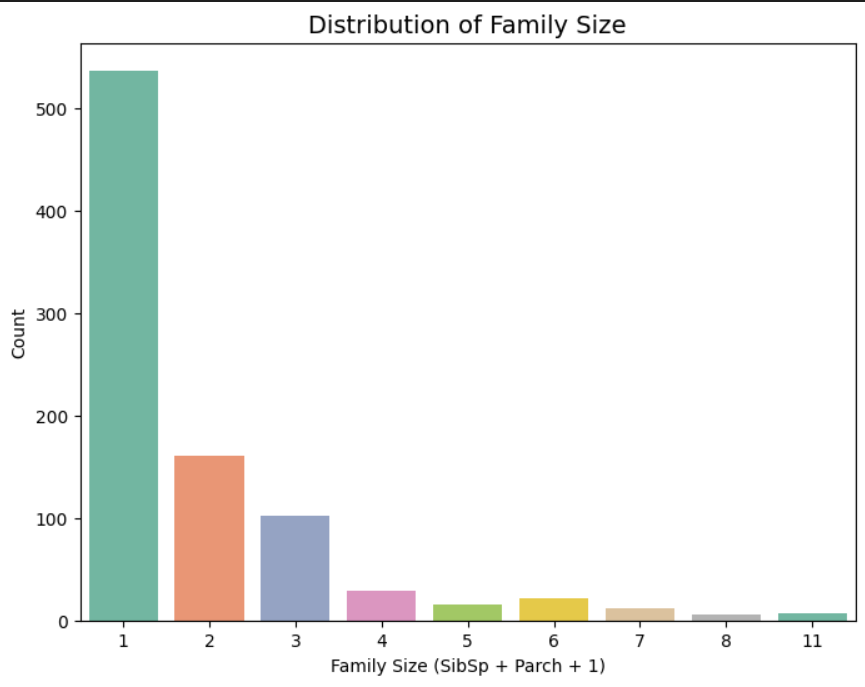

# Titanic Survival Prediction 🛳️

This notebook explores the Titanic dataset, performs data cleaning, feature engineering, and applies machine learning models (Logistic Regression and Random Forest) to predict passenger survival.
---

## Step 2: Dataset Overview

The dataset comes from the famous Kaggle Titanic competition.  
It contains information about passengers on the Titanic, such as demographics, ticket class, and survival status.

### Key Columns
| Column       | Description |
|--------------|-------------|
| PassengerId  | Unique passenger identifier |
| Survived     | Survival (0 = No, 1 = Yes) |
| Pclass       | Ticket class (1 = 1st, 2 = 2nd, 3 = 3rd) |
| Name         | Passenger name (contains titles such as Mr, Mrs, Miss) |
| Sex          | Gender |
| Age          | Age in years |
| SibSp        | Number of siblings/spouses aboard |
| Parch        | Number of parents/children aboard |
| Ticket       | Ticket number |
| Fare         | Passenger fare |
| Cabin        | Cabin number (many missing values) |
| Embarked     | Port of Embarkation (C = Cherbourg, Q = Queenstown, S = Southampton) |

   

---

## 📊 Step 3: Exploratory Data Analysis (EDA)  

We explored the dataset to better understand the relationships between features and survival outcomes.  
Key steps:  
- Inspected dataset structure and checked for missing values.  
- Analyzed feature distributions (e.g., Age, Fare).  
- Studied correlations between numerical features and survival.  
- Visualized survival rates across different passenger groups.  

📌 Example: Survival rates by Age Group  
 

📌 Example: Correlation Heatmap  
  

---

## 🔧 Step 4: Handle Missing Values  

To ensure the dataset is complete and ready for modeling, we handled missing data:  
- **Age**: Imputed using a **Random Forest Regressor**.  
- **Embarked**: Filled missing values with the most frequent value (`S`).  
- **Cabin**: Dropped due to excessive missing values.  

📌 Example: Age distribution before and after imputation  
  

---

## 🏗️ Step 5: Feature Engineering  

We created new features and transformed existing ones to improve model performance:  
- **Title**: Extracted from the passenger’s name (e.g., Mr, Mrs, Miss, etc.).  
- **FamilySize**: Combined `SibSp + Parch + 1`.  
- **IsAlone**: Binary variable indicating if passenger traveled alone.  
- **Categorical Encoding**:  
  - `Sex` → encoded as 0/1.  
  - `Embarked` → one-hot encoded.  
- **Normalization**: Applied Min-Max scaling to continuous variables (`Age`, `Fare`).  

📌 Example: Distribution of new feature *FamilySize*  
  

---

